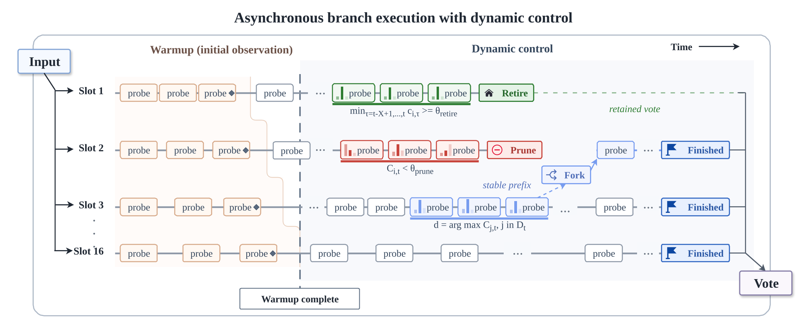

# ParaTempo: Efficient Parallel Reasoning via Temporal Confidence

Official code and dataset repository for the arXiv paper: **ParaTempo: Efficient Parallel Reasoning via Temporal Confidence**.


|  |
|:--:|
|ParaTempo is a training-free asynchronous parallel reasoning framework that uses branch-local temporal confidence to prune, retire, fork, and globally stop parallel reasoning branches.|


## Updates

- **17 Aug, 2026**: Public repository published.

## Code

### Installation

```shell
git clone <repository-url>
cd ParaTempo
conda create -n paratempo python=3.12 -y
conda activate paratempo
pip install -r requirements.txt
```

### Running the vLLM Server

Fill in the placeholders in `server/serve.sh`, or export them from the shell:

```shell
cd server
MODEL=Qwen/Qwen3.5-35B-A3B \
CUDA_DEVICE=GPU_ID_XXX \
PORT=PORT_XXX \
API_KEY=API_KEY_XXX \
bash serve.sh
```

The repository uses local OpenAI-compatible vLLM endpoints. Replace
`GPU_ID_XXX`, `PORT_XXX`, and `API_KEY_XXX` with values from your machine.

### Running Inference

```shell
python run.py \
  --dataset aime26 \
  --model Qwen/Qwen3.5-35B-A3B \
  --model_type qwen \
  --port PORT_XXX \
  --output_dir results/paratempo_aime26
```

For GPT-OSS-20B:

```shell
python run.py \
  --dataset aime26 \
  --model openai/gpt-oss-20b \
  --model_type gpt \
  --port PORT_XXX \
  --output_dir results/paratempo_gptoss20b_aime26
```

### Evaluation

```shell
python eval_results.py --results_dir results/paratempo_aime26 --dataset aime26
python eval_results.py --results_dir results --summary
```

## Datasets

The runner supports:

- `aime26`
- `hmmt25`
- `hmmt26`
- `gpqa`

`aime26`, `hmmt25`, and `hmmt26` are loaded through `datasets.load_dataset`.

## Configuration

The default command-line settings match the main ParaTempo configuration:

```text
num_branches = 16
probe_interval = 500
max_tokens = 16384
window = 7
num_warmup = 15
retire_stability_windows = 9
theta_retire = 0.90
dynamic_prune_percentile = 0.50
```

All environment-specific values, including local ports, GPU ids, API keys, and
optional GPT-OSS tokenizer/template paths, are represented as placeholders or
environment variables.

## Project Structure

```text
.
├── data/
│   └── gpqa/
│       └── README.md
├── paratempo/
│   ├── __init__.py
│   ├── core.py
│   ├── gpt_oss_completion.py
│   └── utils.py
├── scripts/
│   └── pkl_to_json.py
├── server/
│   ├── serve.sh
│   └── template/
│       └── qwen3.jinja
├── eval_results.py
├── requirements.txt
└── run.py
```

